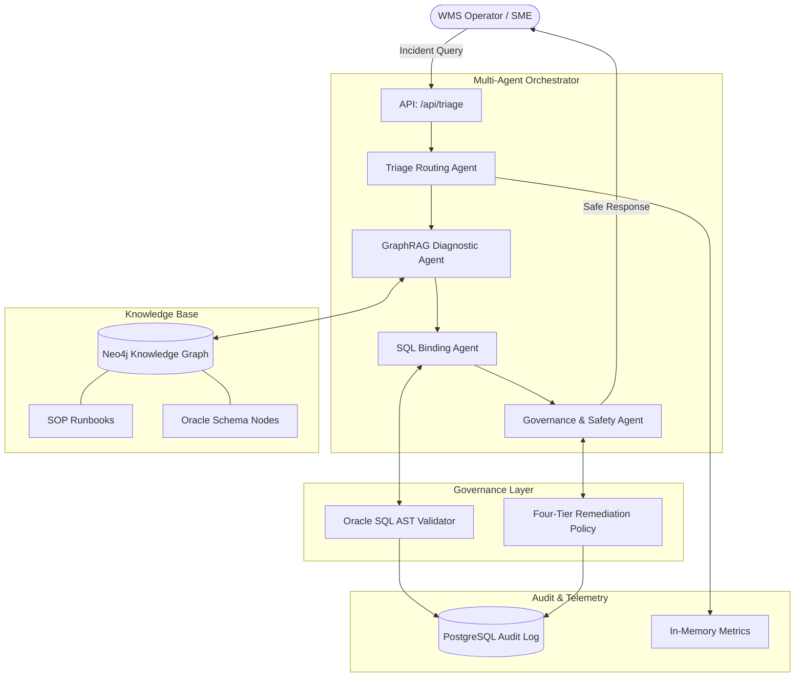

# Yonder Graph — Platform Architecture

## Executive Summary

**Yonder Graph** is an enterprise-grade Supply Chain IT Operations platform that leverages a deterministic GraphRAG (Retrieval-Augmented Generation) architecture to diagnose, triage, and remediate issues within the Blue Yonder Warehouse Management System (WMS). 

Unlike standard conversational LLM applications, Yonder Graph operates under a strict **Zero-Error Governance** model, ensuring that no direct database mutations are hallucinated by the AI. It uses a **Pluggable Multi-LLM Factory**, allowing seamless switching between models like Poolside, Gemini, and OpenAI without altering core application logic.

---

## High-Level Architecture Diagram



---

## Core Components

### 1. Multi-Agent Inference Pipeline
Built on the **Google ADK (Agent Development Kit)**, the inference pipeline is divided into specialized agents:
- **Triage Routing Agent**: Parses natural language to extract domains and business keys.
- **GraphRAG Diagnostic Agent**: Queries Neo4j for structural schema and SOPs.
- **SQL Parameter Binding Agent**: Injects Oracle bind variables securely.
- **Governance Safety Agent**: Recommends the safest remediation path based on the 4-Tier policy.

### 2. The Knowledge Graph (Neo4j)
Acts as the **sole source of truth** for operational logic. It does not store live transactional data (which remains in Oracle), but rather the *metadata* and *procedures*:
- **Tables & Columns**: Structural map of the Oracle WMS.
- **SOP Runbooks**: Standard operating procedures linked to error codes and table nodes.
- **Agent Query Patterns**: Triggers linking natural language to deterministic Cypher queries.

### 3. Zero-Error Governance (Two-Tier)
- **Tier 1 (Cognitive)**: The LLM evaluates risk levels (Low, Medium, High, Critical) and selects a remediation path (MOCA, UI, Patch, Dual-Control).
- **Tier 2 (Deterministic)**: A hard-coded `sqlparse` interceptor blocks all mutation keywords (`INSERT`, `UPDATE`, `DROP`, etc.) and automatically injects `ROWNUM <= 100`.

### 4. Human-in-the-Loop (HITL) Ingestion
New knowledge is polled from Excel workbooks or Markdown files. An Enrichment Agent scores it against a 100-point rubric. If confidence is ≥90%, it auto-ingests. Otherwise, it is staged for SME review in the React Knowledge Studio.

---

## Directory Structure

```text
yonder-graph/
├── backend/
│   ├── api/            # FastAPI REST routes
│   ├── audit/          # PostgreSQL logging & feedback models
│   ├── database/       # Neo4j and PostgreSQL clients
│   ├── governance/     # Tier 2 AST Validator & Tier 1 Policies
│   ├── inference/      # ADK Agents & LLM Provider Factory
│   └── ingestion/      # Canonical loader & HITL workers
├── frontend/
│   ├── src/
│   │   ├── components/ # React UI components (Dashboard, Chat, Graph)
│   │   ├── context/    # Theme state management
│   │   └── services/   # API client mapping
├── knowledge/          # Knowledge ingestion directories
│   ├── canonical/      # Authoritative Excel Blueprints
│   ├── raw/            # Polling directory for new knowledge
│   ├── pending_review/ # Staged for SME approval
│   └── archive/        # Successfully ingested files
```
