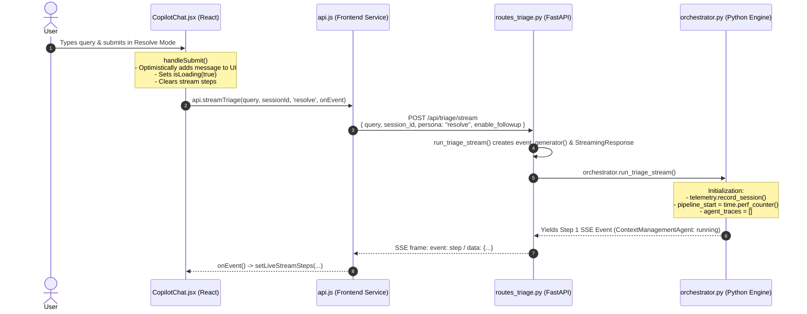

# Yonder Graph Chat Lifecycle Walkthrough

This document outlines the full lifecycle for the user query: 
**"We're seeing ERR_INVALID_VENDOR_CODE on an inbound PO integration message, trans_id 55901 — how do I diagnose it?"**

---

## 1. Frontend-Backend Integration

Here is the end-to-end flow showing every React component, service, backend FastAPI endpoint, and orchestrator initialization method from the moment the user clicks **Submit** in **Resolve Mode** until the first triage agent begins execution:

---

### Sequence Diagram



---

### Step-by-Step Breakdown

#### 1. React Component Level: [`frontend/src/components/CopilotChat.jsx`](file:///Users/arkopalbhattacharya/source/yonder-graph/frontend/src/components/CopilotChat.jsx)
- **Trigger**: The user clicks the send button or presses `Enter` in the chat input while in **Resolve Mode** (`persona = 'resolve'`).
- **Method**: [`handleSubmit(e)`](file:///Users/arkopalbhattacharya/source/yonder-graph/frontend/src/components/CopilotChat.jsx#L458-L498)
- **Actions**:
  1. Calls `e.preventDefault()` and validates non-empty input.
  2. Optimistically appends the user prompt to the local state: `setMessages(prev => [...prev, userMessage])`.
  3. Sets `setIsLoading(true)` and resets prior live steps: `setLiveStreamSteps([])`.
  4. Creates an `AbortController` instance to allow request cancellation.
  5. Invokes `api.streamTriage()` passing an `onEvent` callback that dynamically updates the live timeline badges as streaming SSE chunks arrive.

---

#### 2. Frontend API Client: [`frontend/src/services/api.js`](file:///Users/arkopalbhattacharya/source/yonder-graph/frontend/src/services/api.js)
- **Method**: [`streamTriage(query, sessionId, persona, onEvent, signal, enableFollowup)`](file:///Users/arkopalbhattacharya/source/yonder-graph/frontend/src/services/api.js#L41-L95)
- **Actions**:
  1. Issues an asynchronous `fetch` request:
     ```javascript
     fetch(`${API_BASE}/triage/stream`, {
       method: 'POST',
       headers: { 'Content-Type': 'application/json' },
       body: JSON.stringify({
         query,
         session_id: sessionId,
         persona: 'resolve',
         enable_followup: enableFollowup
       }),
       signal
     });
     ```
  2. Initializes a `ReadableStreamDefaultReader` via `response.body.getReader()`.
  3. Uses `TextDecoder('utf-8')` to parse incoming SSE blocks (`event: ...`, `data: ...`) and dispatches parsed JSON frames to the React `onEvent` listener.

---

#### 3. Backend FastAPI Route: [`backend/api/routes_triage.py`](file:///Users/arkopalbhattacharya/source/yonder-graph/backend/api/routes_triage.py)
- **Endpoint**: `@router.post("/triage/stream")`
- **Method**: [`run_triage_stream(request: TriageRequest, db: Session = Depends(get_db))`](file:///Users/arkopalbhattacharya/source/yonder-graph/backend/api/routes_triage.py#L80-L127)
- **Actions**:
  1. Validates the incoming Pydantic payload (`TriageRequest`).
  2. Defines a generator function `event_generator()` that iterates over `orchestrator.run_triage_stream(...)`.
  3. Returns a FastAPI `StreamingResponse` with:
     - `media_type="text/event-stream"`
     - `Cache-Control="no-cache"`
     - `X-Accel-Buffering="no"` (prevents reverse-proxy buffering).

---

#### 4. Python Orchestrator Initialization: [`backend/inference/orchestrator.py`](file:///Users/arkopalbhattacharya/source/yonder-graph/backend/inference/orchestrator.py)
- **Method**: [`TriageOrchestrator.run_triage_stream(query, session_id, persona, enable_followup)`](file:///Users/arkopalbhattacharya/source/yonder-graph/backend/inference/orchestrator.py#L387-L413)
- **Pre-Triage Initialization**:
  1. Assigns or preserves the session identifier: `session_id = session_id or str(uuid.uuid4())`.
  2. Increments session telemetry counter: [`telemetry.record_session()`](file:///Users/arkopalbhattacharya/source/yonder-graph/backend/inference/telemetry.py).
  3. Starts the master stopwatch: `pipeline_start = time.perf_counter()`.
  4. Initializes the `agent_traces = []` list to record per-agent latencies and outputs.
  5. Emits the first SSE event payload notifying the frontend that **Step 1 (`ContextManagementAgent`)** is `running`.


---


## 2. Multi-Agent Invocation Flow

When the user submits the query in the frontend chat, the message is sent to the backend `orchestrator.py` which executes the multi-agent diagnostic pipeline using the `run_triage_stream` method.

### Step 1: `ContextManagementAgent` (Session Context & Multi-Turn Policy Guard)

- **Role**: Tracks session context, evaluates multi-turn policies, and resolves follow-up questions.
- **Code Reference**: `backend/inference/orchestrator.py:run_triage_stream()` invoking `context_manager.evaluate_turn_and_context()`.

### Step 2: `PIISanitizerAgent` (Tier 0 Inbound PII Masking & Tokenization)
- **Role**: On-premise security guard that intercepts the prompt before external LLM dispatch.
- **Execution**: Scans the input text for sensitive customer data (names, emails, phone numbers, addresses, credit cards) and replaces them with surrogate tokens (e.g., `<PII_EMAIL_1>`). If PII is intercepted, a Tier 0 Governance audit log is recorded.
- **Code Reference**: `backend/inference/orchestrator.py:461-523` invoking `pii_engine.sanitize_text()`.

### Step 3: `IntentClassifierAgent` (Cognitive Gateway & Guard)
- **Role**: Determines the routing mode. The query triggers the regex `\berr[_\w-]*` and `\btrans(?:action)?[_\s-]*id\b` causing a direct route to `INCIDENT_TRIAGE` for Resolve Mode.
- **Critical Method**: `backend/inference/orchestrator.py:_classify_intent()`. This acts as a gateway ensuring domain boundaries are enforced before proceeding.

### Step 4: `TriageRoutingAgent` (Incident Parsing & Business Key Extraction)
- **Role**: Parses the raw query to extract actionable business keys and identify the WMS domain (Inbound).
- **Extraction**: It successfully extracts `error_code: ERR_INVALID_VENDOR_CODE` and `trans_id: 55901`.
- **Critical Method**: `backend/inference/orchestrator.py:_parse_incident()` which relies on LLM calls, falling back to `_fallback_parse()` for rigid regex extraction.

### Step 5: `GraphRAGDiagnosticAgent` (Neo4j SOP Runbook Retrieval)
- **Role**: Queries the Neo4j Knowledge Graph to find the corresponding issue pattern and SOP runbook.
- **Execution**: Uses the extracted WMS Domain (Inbound) and error code to locate the relevant `(:SOPRunbook)` node. It returns deterministic triage steps and Oracle SQL templates.
- **Critical Method / Tools**: Invokes `query_knowledge_graph` and `search_sop_runbooks` defined in `backend/inference/tools.py`.

### Step 6: `SQLParameterBindingAgent` (Safe SQL Interpolation & AST Guard)
- **Role**: Safely interpolates the SQL template from the SOP runbook with the extracted business key (`trans_id: 55901`).
- **Safety Gate**: Runs a Tier 2 AST Validator (`validate_oracle_sql`) to ensure the SQL is strictly read-only (`SELECT`) before executing or presenting it.
- **Critical Method**: `backend/inference/orchestrator.py:_bind_and_validate_sql()` utilizing `bind_sql_parameters` and `validate_oracle_sql`.

### Step 7: `GovernanceSafetyAgent` (Tier 1 Cognitive Governance)
- **Role**: Operational risk evaluation (Tier 1 Governance). Evaluates the remediation action for risk level (e.g., `LOW_RISK_READONLY`), assigns MOCA tiering, and checks if SME approval is required.
- **Critical Method**: `backend/inference/orchestrator.py:_evaluate_governance()` utilizing `get_remediation_policy` and `log_governance_decision`.

### Step 8: `ResolveTriageAgent` (Structured Investigation Steps Decomposition)
- **Role**: Decomposes the diagnostic SOP and bound SQL into step-by-step investigation cards with query statements, expected results, and corrective actions.
- **Critical Method**: `backend/inference/orchestrator.py:_synthesize_investigation_steps()`.

### Step 9: `HumanizingAgent` (Multi-Persona Narrative & Reasoning)
- **Role**: Synthesizes a clear, markdown-formatted summary tailored to L1 Ops, L2 Support, and L3 SMEs. Generates the final cognitive reasoning trace.
- **Critical Method**: `backend/inference/orchestrator.py:_synthesize_narrative()`.

### Step 10: `PIISanitizerAgent` (Tier 0 Outbound PII De-tokenization & Backfill)
- **Role**: Replaces the surrogate tokens in the synthesized response with the original customer data so the authenticated local user sees the unmasked operational view.
- **Code Reference**: `backend/inference/orchestrator.py:781-796` invoking `pii_engine.detokenize_payload()`.

---

## 3. Google ADK (Agent Development Kit) in Yonder Graph

Yonder Graph uses the **Google Agent Development Kit (ADK)** conceptual framework to power its multi-agent squad. However, the system employs a highly deterministic, manually orchestrated implementation of these concepts to ensure strict enterprise governance and auditable state management.

### Simulated Architecture

Instead of using black-box agent orchestrators, Yonder Graph explicitly defines the squad hierarchy using fabricated constructs in `backend/inference/agents.py`. The `CoordinatorAgent` manually orchestrates state transitions between specialized sub-agents.

```python
# backend/inference/agents.py

# Mocks for fabricated google-adk classes that do not exist in the real SDK.
# The orchestrator manually implements this sequence.
class LlmAgent:
    def __init__(self, **kwargs):
        pass

class SequentialAgent:
    def __init__(self, **kwargs):
        pass
```

### Key Reasons for This Architecture

| Area                      | Full Autonomous ADK Loop                                     | Yonder Graph Deterministic Orchestration                     |
| :------------------------ | :----------------------------------------------------------- | :----------------------------------------------------------- |
| **Safety & Governance**   | The LLM decides *when* or *if* to call safety tools. Risk of hallucinated queries bypassing security. | **Deterministic Hard Gates**: Tier 0 PII masking, Tier 1 Governance, and Tier 2 AST SQL validation are **mandatory checkpoints** that cannot be skipped. |
| **Real-Time Streaming**   | Many SDK agent runtimes block until the full execution graph finishes or stream raw tool call chunks. | **Granular SSE Step Frames**: Streams real-time agent badges, live ticking stopwatches (`• 0.42s`), and individual step latencies directly to the React UI. |
| **LLM Provider Agnostic** | Tightly couples your application to Google's SDK and model ecosystem. | Portable through `LLMProviderFactory` (can switch between Gemini, Poolside, or on-prem models). |
| **Auditing & Compliance** | Harder to intercept and log intermediate states consistently. | Every agent step has dedicated `AuditTimer` blocks, token accounting, and logs to PostgreSQL via `audit_logger`. |

### How to Explain This in Your Demo

If asked by your manager or team lead:

> *"We adopt Google ADK's multi-agent architectural model for squad specialization, prompt engineering, and tool declarations, but we intentionally enforce a **Deterministic Governed Orchestrator** in Python. This ensures enterprise-grade PII protection, guaranteed read-only AST SQL validation, and sub-second real-time streaming observability rather than relying on unconstrained, black-box agent loops."*

### Agnostic LLM Execution

The agents rely on `LLMProviderFactory` (`backend/inference/llm_provider.py`) for inference. Because the ADK agents use strict role-based prompts and output structured JSON, the entire multi-agent squad remains agnostic to the underlying provider (e.g., Gemini vs. Poolside). 

### Telemetry and Auditing
According to `docs/adk_multi_agent_framework.md`, the ADK squad is instrumented comprehensively:
- Each agent's latency, token consumption, and success rates are tracked by the `TelemetryCollector`.
- The frontend `AgentDetailModal.jsx` natively renders this data on the React Agent Dashboard, allowing the user to inspect the exact `agent_name` from the ADK squad that performed specific actions (e.g., *Cognitive Governance (ADK GovernanceSafetyAgent)*).

---


## 4. How The Graph Visualizer Works

Here is the simple, high-level breakdown of how the **Graph Visualizer** works:

------

### The 3-Step Lifecycle

```
1. Neo4j Database          2. FastAPI Backend               3. React Frontend

┌──────────────────┐       ┌────────────────────────┐       ┌───────────────────────┐

│ Nodes & Edges    │ ───►  │ Formats names, colors, │ ───►  │ Interactive D3 Canvas │

│ (Tables, SOPs,   │       │ and sizes into JSON    │       │ with Physics & Zoom   │

│  Domains, Terms) │       │ via /api/graph/schema  │       │ Inspector Panel       │

└──────────────────┘       └────────────────────────┘       └───────────────────────┘
```

------

### 1. Backend (How data is prepared)

- **Script**: `backend/database/neo4j_client.py`
- **Method**: `get_full_graph_for_viz()`
- **What it does**:
  1. Runs a simple Cypher query in Neo4j to grab all nodes and relationships.
  2. Assigns standard colors and sizes:
     - 🟢 **Domain**: Large Emerald (`val: 12`)
     - 🔵 **Table**: Medium Blue (`val: 8`)
     - 🟡 **SOP Runbook**: Warm Yellow (`val: 7`)
     - 🔘 **Business Flow / Term**: Slate Grey (`val: 5-6`)
     - 🌸 **Column**: Small Pink (`val: 4`)
  3. Sends this clean JSON `{ nodes: [...], edges: [...] }` to the frontend.

------

### 2. Frontend (How data is rendered)

- **Component**: `frontend/src/components/GraphVisualizer.jsx`
- **What it does**:
  1. **D3 Physics Engine**: Uses `ForceGraph2D` with repulsion physics so clusters spread out neatly without overlapping.
  2. **Domain & View Filters**: Users can toggle between *Inbound*, *Outbound*, or *Inventory*, or hide column nodes to avoid visual clutter.
  3. **Search & Focus**: Typing in the search bar or clicking a node smoothly zooms in (`2.5x`) and fades out unrelated nodes to 10% opacity.
  4. **Inspector Side Panel**: Clicking any Table or SOP node slides open a details drawer showing primary keys, table joins, and copy-pasteable Oracle diagnostic SQL.
